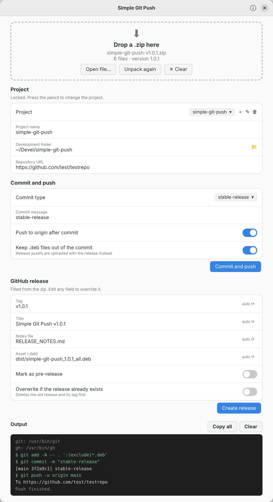

# Simple Git Push

A small GTK 4 app for Ubuntu that turns a zip file into a pushed commit and a GitHub release.

When Claude generates a project, it delivers a `files.zip` with the source code, readme, release notes,
build script, license and often a `.deb`, plus the git commands to run. Simple Git Push runs those
steps for you.



*Rendering of the interface.*

## What it does

1. **Import**: drop a `.zip` on the window or use **Open file**. **Clear** removes the loaded zip and empties
   the commit message (for `auto-generated` and `custom`) and the release fields. It never touches files on disk.
2. **Unpack**: the files go into your development folder. If files already exist and differ, you are asked
   whether to replace them or keep the existing ones. Identical files are left alone.
3. **Commit and push**: the commit message comes from the **Commit type**:
   - `stable-release` or `beta-release`: the message is that text.
   - `auto-generated`: the message is made from the name of the `.patch` or `.diff` file in the zip,
     for example `fix-login-crash_v1.2.patch` becomes `Fix login crash`. Names that do not start with a verb get
     `Update` in front. Without a patch file, the zip file name is used, and if nothing readable is left the
     message is `Update to vX.Y.Z`.
   - `custom`: type your own message.
4. **GitHub release**: runs `gh release create` with the tag, `--title`, `--notes-file` and the `.deb`,
   all filled from the zip. Every field can be overridden.
5. **Output pane**: shows each command and its output, including errors. The text is selectable, and
   **Copy all** puts it on the clipboard.

## Projects

Save several projects (name, development folder, repository, commit type and options) and switch between
them with the **Project** dropdown. Use **+** to add one and the trash button to remove one (only the saved
settings are removed, never your files).

The project name, development folder and repository are locked. Press the **pencil** to change them and the
**check mark** to save and lock them again. A new project opens in edit mode. Settings are stored in `~/.config/simple-git-push/settings.json`.

## How the version and release fields are found

| Field | Source, first match wins |
| --- | --- |
| Version | `VERSION` file, the `.deb` file name, the zip file name, the heading in the release notes |
| Tag | `v` + version |
| Title | first `# heading` of the readme (or the zip name) + tag |
| Notes file | `RELEASE_NOTES.md`, `release-notes`, `CHANGELOG` |
| Asset | the `.deb` that matches the version |

By default `.deb` files are kept out of the git commit and are uploaded with the release instead.

## Install

Requires Ubuntu 26.04 (or any recent GNOME desktop) with GTK 4 and libadwaita.

```bash
sudo apt install ./simple-git-push_1.2.1_all.deb
sudo apt install gh        # for releases
gh auth login              # once
```

Git needs to be able to push to your repository (SSH key or a credential helper), because the app cannot
answer password prompts.

Start **Simple Git Push** from the application menu. You can also right-click a zip file and open it with the app.

## Build the package

```bash
./build-deb.sh
```

This creates `dist/simple-git-push_1.2.1_all.deb`.

## Run from source

```bash
sudo apt install python3-gi gir1.2-gtk-4.0 gir1.2-adw-1 git gh
python3 -m simple_git_push [files.zip]
python3 -m unittest discover -s tests -v
```

## About

The **info** button in the title bar shows the version, the repository link, the license (MIT) and credits.
Set your own repository address in `simple_git_push/__init__.py` (`REPO_URL`) before building.

## Notes

- The app pushes the current branch (new repositories start on `main`) and sets `origin` to the repository
  URL you entered.
- **Overwrite if the release already exists** deletes the old release and its tag, then creates it again.
- See [CLAUDE.md](CLAUDE.md) for how this project was made and tested.

## License

MIT, see [LICENSE](LICENSE).
